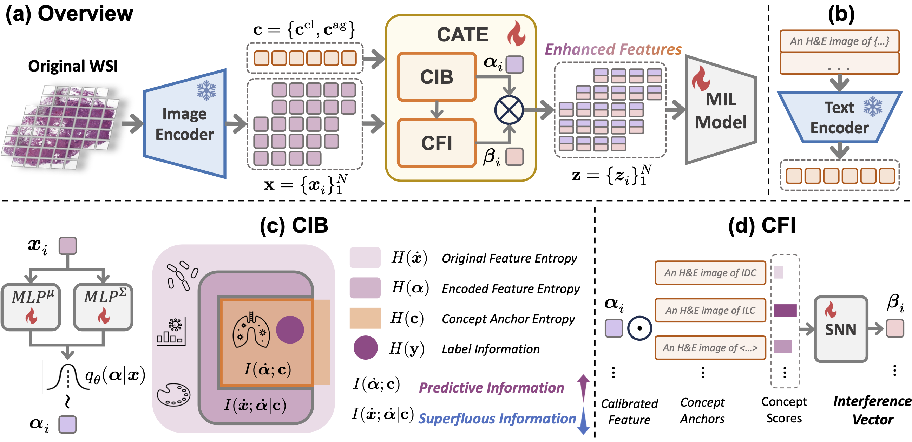

# CATE

This is the official code for the paper "Free Lunch in Pathology Foundation Model: Task-specific Model Adaptation with Concept-Guided Feature Enhancement".



## Usage

1. Download model weights from [CONCH](https://github.com/mahmoodlab/CONCH).

2. Generate concept anchors by `python generate_concept_anchor.py`.

3. Use CATE-MIL (`catemil.py`) to train your model or integrate the CATE (`cate.py`) into your MIL model.


## Citation

If you find this work useful in your research, please consider citing:

```
@inproceedings{
huang2024free,
title={Free Lunch in Pathology Foundation Model: Task-specific Model Adaptation with Concept-Guided Feature Enhancement},
author={Yanyan Huang and Weiqin Zhao and Yihang Chen and Yu Fu and Lequan Yu},
booktitle={The Thirty-eighth Annual Conference on Neural Information Processing Systems},
year={2024},
url={https://openreview.net/forum?id=dwYekpbmYG}
}
```

## Acknowledgement

We would like to thank the authors of [CONCH](https://github.com/mahmoodlab/CONCH) for their excellent work.